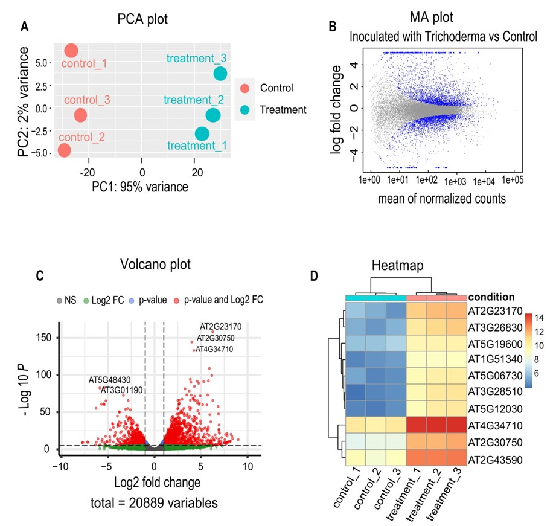
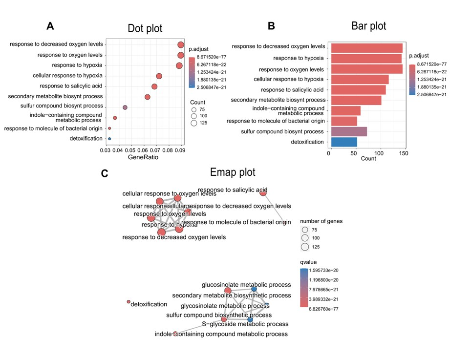
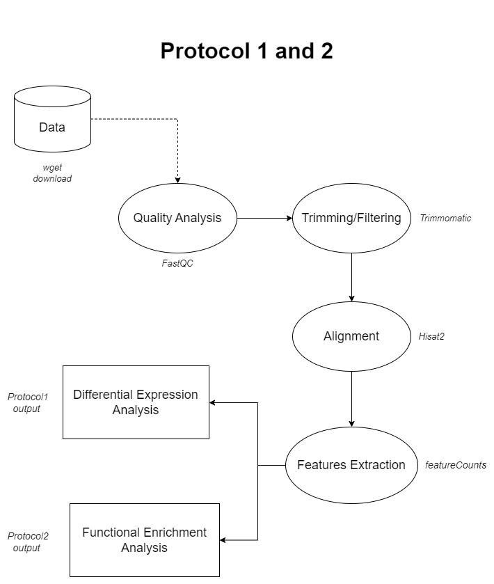
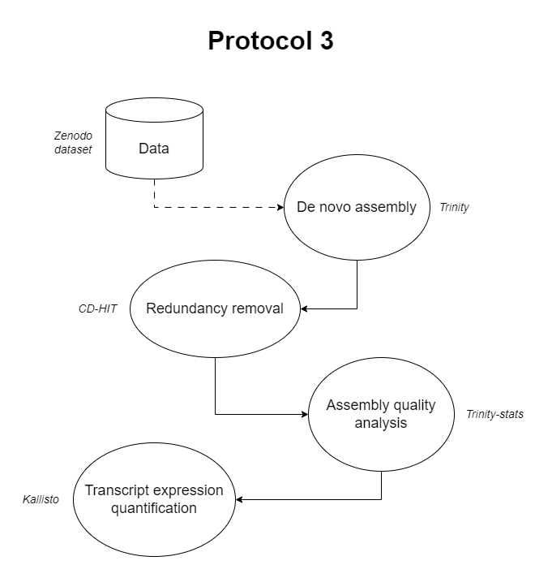

# RNA-seq-protocol
 [](https://zenodo.org/records/10576137)


 This is the protocol for conducting RNAseq analysis in plants. This repository has been created to make it easier to follow the protocol presented in the Current Protocols journal by Pola-Sanchez et al., 2024.

  To streamline the execution of the scripts within this repository, we recommend using Docker. Docker provides a consistent environment for running applications, ensuring that your scripts run smoothly across different platforms. If you haven't installed Docker yet, you can download it based on your operating system:

- **Linux Users:** [Install Docker for Linux](https://docs.docker.com/desktop/install/linux-install/)
- **Windows Users:** [Install Docker for Windows](https://docs.docker.com/desktop/install/windows-install/)
- **MacOS Users:** [Install Docker for Mac](https://docs.docker.com/desktop/install/mac-install/)

Once Docker is installed, you'll be able to effortlessly run the scripts in this repository and benefit from a reproducible and isolated environment. Follow the steps in the Running section to reproduce our results.


## Running

[](https://hub.docker.com/repository/docker/rafape/rna_protocol/general)

First, download the Docker image for the project using the following command. This fetches the Docker image `rafape/rna_protocol` with version `2.0` from the official Docker Hub repository. The image contains all executable software packages, necessary dependencies, and configurations to run the specified protocols.


```bash
docker pull rafape/rna_protocol:2.0
```

Next, clone the project repository to your local machine using the following command. This retrieves all files in the repository and places them in the current directory.

```bash
git clone https://github.com/jmvillalobos/RNA-seq-protocol.git
```
Then, we will work on the main directory of the proyect called `RNA-seq-protocol`. So after clonning the repository, we move to the directory with the next command:

```bash
cd RNA-seq-protocol
```


Finally, run the Docker container. Below is an example of running the `run_all_protocols.sh` script. Adjust the command based on your operating system.

**For Linux/MacOS users:**

```bash
docker run --rm -v $(pwd)/RNA_protocol/:/RNA_protocol/ -v $(pwd)/src/:/src/ rafape/rna_protocol:2.0 /src/run_all_protocols.sh
```
**For Windows users:**

```bash
docker run --rm -v $pwd/RNA_protocol/:/RNA_protocol/ -v $pwd/src/:/src/ rafape/rna_protocol:2.0 /src/run_all_protocols.sh
```

The previous command can be used to run any of the protocols scripts separately by changing the path of the bash file at the end. 

```bash
docker run --rm -v $(pwd)/RNA_protocol/:/RNA_protocol/ -v $(pwd)/src/:/src/ rafape/rna_protocol:2.0 /src/run_protocol1.sh
docker run --rm -v $(pwd)/RNA_protocol/:/RNA_protocol/ -v $(pwd)/src/:/src/ rafape/rna_protocol:2.0 /src/run_protocol2.sh
docker run --rm -v $(pwd)/RNA_protocol/:/RNA_protocol/ -v $(pwd)/src/:/src/ rafape/rna_protocol:2.0 /src/run_protocol3.sh
```

> **Important Note**
>
> If you choose to run the complete pipeline using the `run_all_protocols.sh` script, please be aware that this process involves downloading all the necessary data and generating intermediate files. This operation requires significant time (approximately two hours or more) and disk space (at least 8GB).
>
> If you prefer a quicker or more resource-efficient option, consider running individual protocol scripts separately, as described above.

Alternatively, you can run the Docker container in interactive mode, allowing you to run the tools in the container, follow the protocol as outlined in the paper, run and edit scripts, navigate directories, and more. This interactive mode is particularly beneficial if you want to personally execute bioinformatic tools, tweak parameters, experiment with files, and explore the environment.

To run docker container in interactive mode, use the following command:

**For Linux/MacOS users:**

```bash
docker run --rm -it -v $(pwd)/RNA_protocol/:/RNA_protocol/ -v $(pwd)/src/:/src/ rafape/rna_protocol:2.0
```
**For Windows users:**

```bash
docker run --rm -it -v $pwd/RNA_protocol/:/RNA_protocol/ -v $pwd/src/:/src/ rafape/rna_protocol:2.0
```

This will take you to the container enviroment where all the bioinformatic tools and system dependencies are installed.


## Protocol 1

**Step 1: Data Download**
Downloads raw RNA-seq data from the European Nucleotide Archive (ENA) related to the study of Trichoderma atroviride's Nox genes during interaction with Arabidopsis thaliana.

**Step 3: Quality Check on Raw Reads with FastQC**
Evaluates the quality of raw data using FastQC, analyzing metrics such as per base sequence quality.

```bash
fastqc /RNA_protocol/raw_data/*.gz* --outdir /RNA_protocol/quality_raw/
```

**Step 4: Read Trimming with Trimmomatic**


Trims raw reads using Trimmomatic to remove low-quality bases, adapter sequences, and short reads.
```bash
for sample in 204 206 210 212 216 218; 
do
    trimmomatic PE -phred33 \
        /RNA_protocol/raw_data/SRR10207${sample}_1.fastq.gz \
        /RNA_protocol/raw_data/SRR10207${sample}_2.fastq.gz \
        /RNA_protocol/trimming_data/SRR10207${sample}_P_1.fastq.gz /RNA_protocol/trimming_data/SRR10207${sample}_U_1.fastq.gz \
        /RNA_protocol/trimming_data/SRR10207${sample}_P_2.fastq.gz /RNA_protocol/trimming_data/SRR10207${sample}_U_2.fastq.gz \
        ILLUMINACLIP:/usr/local/bin/Trimmomatic-0.39/adapters/TruSeq3-PE.fa:2:30:10 \
        SLIDINGWINDOW:4:15 MINLEN:36
done
```

**Step 5: Alignment of Reads**

- Creates an index for the reference genome.
- Aligns trimmed reads to the Arabidopsis thaliana reference genome using HISAT2.

```bash
# Build index
hisat2-build -p 4 /RNA_protocol/genome_arabidopsis/Arabidopsis_thaliana.TAIR10.dna.toplevel.fa /RNA_protocol/index_hisat2/genome
```
```bash
# Align to reference genome
for sample in 204 206 210 212 216 218; 
do
    hisat2 -p 4 -x /RNA_protocol/index_hisat2/genome \
        -1 /RNA_protocol/trimming_data/SRR10207${sample}_P_1.fastq.gz \
        -2 /RNA_protocol/trimming_data/SRR10207${sample}_P_2.fastq.gz \
        -S /RNA_protocol/alignment_hisat2/SRR10207${sample}.sam

    samtools sort /RNA_protocol/alignment_hisat2/SRR10207${sample}.sam -o  /RNA_protocol/alignment_hisat2/SRR10207${sample}_sorted.bam
done
```

**Step 6: Quantification of Mapped Reads**

- Downloads the GTF annotation file for Arabidopsis thaliana.
- Quantifies the number of mapped reads using featureCounts.
- Creates a count matrix for downstream analysis ([matriz_arabidopsis_2023.txt](http://example.com))


```bash
for file in $/RNA_protocol/alignment_hisat2/*.bam
do
    name=$(basename ${file} .bam)
    featureCounts -p --countReadPairs -t exon -g gene_id \
        -a /RNA_protocol/genome_arabidopsis/Arabidopsis_thaliana.TAIR10.57.gtf \
        -o /RNA_protocol/quantification_featureCounts/featureCounts_output/${name}.txt \
        /RNA_protocol/alignment_hisat2/${name}.bam
done
```
```bash
ls -1 /RNA_protocol/quantification_featureCounts/featureCounts_output/*.txt | parallel 'cat {} | sed '1d' | cut -f7 {} > /RNA_protocol/quantification_featureCounts/{/.}_clean.txt'
ls -1 /RNA_protocol/quantification_featureCounts/featureCounts_output/*.txt | head -1 | xargs cut -f1 > /RNA_protocol/quantification_featureCounts/genes.txt
paste /RNA_protocol/quantification_featureCounts/genes.txt /RNA_protocol/quantification_featureCounts/*clean.txt > /RNA_protocol/quantification_featureCounts/matriz_arabidopsis_2023.txt
```

**Step 7: Differential Expression Analysis**

- Performs differential expression analysis using DESeq2 in R.
- Filters lowly expressed genes.
- Generates PCA plots for quality assessment.
- Saves results, create volcano plots, and identify differentially expressed genes (DEGs).

See [Differential Expression Script](./src/scripts/differential_expression_analysis.R)

<!-- <p align="center">

</p> -->

## Protocol 2

**Gene Ontology Enrichment Analysis**

This protocol uses clusterProfiler to perform Over-Representation Analysis (ORA), a widely used approach to determine whether known biological functions or processes are over-represented (enriched) in an experimentally derived list of genes, for example, a list of differentially expressed genes (protocol 1)

See [Functional Enrichment Script](./src/scripts/functional_enrichment_analysis.R)

<!-- <p align="center">

</p> -->
<p align="center">

</p>


## Protocol 3
**De novo Assembly with Trinity**
- Executes de novo transcriptome assembly using Trinity.
- Results in `Trinity.fasta` and `Trinity.fasta.gene_trans_map` representing assembled transcripts.
```bash
Trinity --seqType fq  --samples_file samples.txt --CPU 4 --max_memory 12G
mv trinity_out_dir.Trinity.fasta Trinity.fasta
mv trinity_out_dir.Trinity.fasta.gene_trans_map Trinity.fasta.gene_trans_map
```
 > The samples file used in the command `samples.txt` was manually generated and it is available in the repository [here](./RNA_protocol/novo_assembly/trinity_analysis/samples.txt)

**Step 2: Evaluating the Assembly**

- Counts Assembled Transcripts

- Uses a command to count the number of assembled transcripts and obtain Comprehensive Assembly Statistics

- Includes N50, GC content, and contig lengths.

```bash
perl /usr/local/bin/trinityrnaseq-v2.13.2/util/TrinityStats.pl Trinity.fasta
```
```console
################################
## Counts of transcripts, etc.
################################
Total trinity 'genes':  1884
Total trinity transcripts:      2116
Percent GC: 49.26

########################################
Stats based on ALL transcript contigs:
########################################

        Contig N10: 1268
        Contig N20: 981
        Contig N30: 736
        Contig N40: 585
        Contig N50: 462

        Median contig length: 315
        Average contig: 431.78
        Total assembled bases: 913641


#####################################################
## Stats based on ONLY LONGEST ISOFORM per 'GENE':
#####################################################

        Contig N10: 1227
        Contig N20: 845
        Contig N30: 632
        Contig N40: 504
        Contig N50: 413

        Median contig length: 303
        Average contig: 402.23
        Total assembled bases: 757802
```

**Step 3: Redundancy Removal**

- Applies CD-HIT to remove redundancy from the transcriptome assembly.
- Reduces the number of contigs.

```bash
cd-hit-est -i Trinity.fasta -o Trinity_90.fasta -c 0.9 -n 9
```
```bash
perl /usr/local/bin/trinityrnaseq-v2.13.2/util/TrinityStats.pl Trinity_90.fasta
```
```console
################################
## Counts of transcripts, etc.
################################
Total trinity 'genes':  1869
Total trinity transcripts:      1904
Percent GC: 49.19

########################################
Stats based on ALL transcript contigs:
########################################

        Contig N10: 1198
        Contig N20: 857
        Contig N30: 646
        Contig N40: 514
        Contig N50: 419

        Median contig length: 305
        Average contig: 405.38
        Total assembled bases: 771847


#####################################################
## Stats based on ONLY LONGEST ISOFORM per 'GENE':
#####################################################

        Contig N10: 1227
        Contig N20: 843
        Contig N30: 630
        Contig N40: 505
        Contig N50: 413

        Median contig length: 303
        Average contig: 402.57
        Total assembled bases: 752400

```
**Step 4: Transcript Expression Quantification with Kallisto**

- Uses Kallisto to estimate expression values of transcripts.
- Creates directories for each replicate and inspected the quantification results.

```bash
perl /usr/local/bin/trinityrnaseq-v2.13.2/util/align_and_estimate_abundance.pl \
--seqType fq --samples_file /RNA_protocol/novo_assembly/trinity_analysis samples.txt \
--transcripts /RNA_protocol/novo_assembly/trinity_analysis/Trinity_90.fasta \
--est_method kallisto --trinity_mode --prep_reference
```
<p align="center">


<!-- ## Diagrams

<p align="center">

</p>


<p align="center">

</p>    -->
